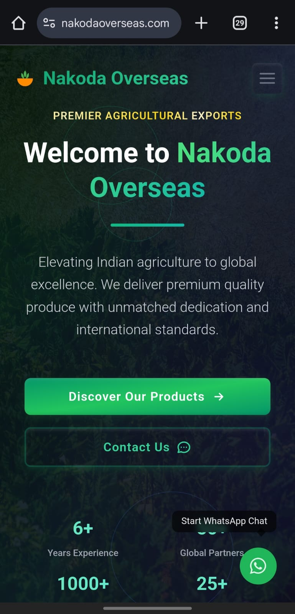
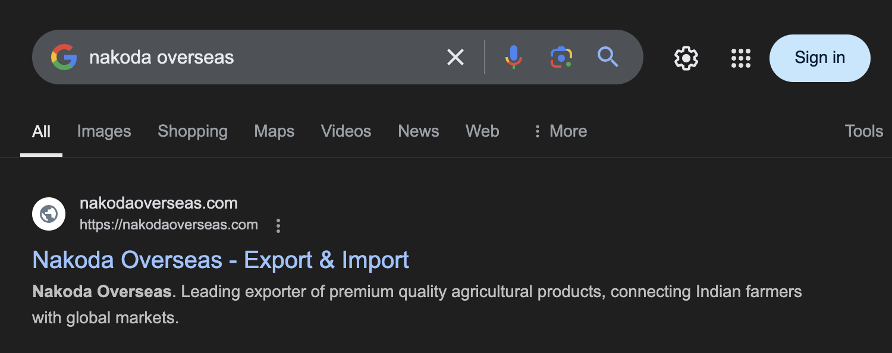

# Nakoda Overseas - Agricultural Export Company 🌾  

Welcome to the repository for **Nakoda Overseas**, an agricultural export company's official website. This project is built with **React.js**, featuring a clean and responsive UI/UX, SEO optimization, and a business-oriented design to enhance online visibility and drive growth.  

## 🌟 Live Website  
Check out the live version of the website here: [nakodaoverseas.com](https://nakodaoverseas.com/)  

---

## 📽️ Project Overview  
This project showcases:  
- A **responsive design** ensuring seamless usability across all devices.  
- **Clean UI/UX** crafted for a professional and engaging user experience.  
- **SEO optimization** to boost search engine rankings and attract organic traffic.  
- Hosted and deployed for a smooth and reliable online presence.  

---

## 📽️ Demo Video  
Watch the demo video of the website in action:  
[](https://drive.google.com/file/d/1VKnWEc5m6boIiS31Yo3J_MS5_wQk3hQB/view?usp=sharing)  
*Click the image to watch the video!*  

---

## 📷 Visuals  

### Homepage (Mobile Responsive)  
<p align="center">  
    
</p>  

### Search Engine Preview  
<p align="center">  
    
</p>  

---

## 🛠️ Built With  
- **React.js**: For a dynamic and responsive front-end.  
- **CSS3**: To create an aesthetically pleasing design.  
- **SEO Best Practices**: For enhanced search engine performance.  
- **Deployment**: Hosted for live access at [nakodaoverseas.com](https://nakodaoverseas.com/).  

---

## 🚀 Features  
- **Responsive Design**: Mobile-first approach for accessibility on any device.  
- **Business-Oriented**: Built to align with the goals of Nakoda Overseas.  
- **Fast Performance**: Optimized for speed and efficiency.  
- **Easy Navigation**: Clean structure for intuitive browsing.  

---

## 📈 Goals  
- Improve online visibility for Nakoda Overseas.  
- Provide users with an easy and informative experience.  
- Showcase the company’s products and services effectively.  

---

## 🔧 Installation & Setup  
1. Clone the repository:  
   ```bash  
   git clone https://github.com/your-username/nakoda-overseas.git  
